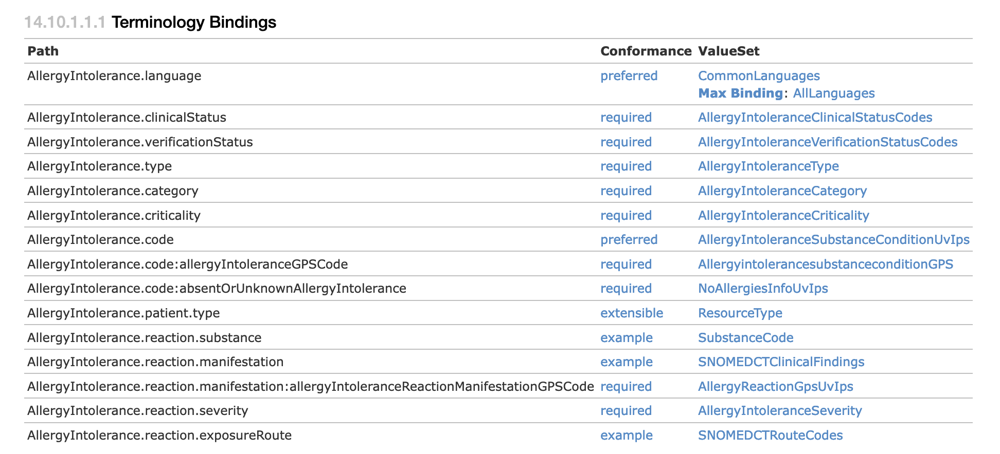

# IPS Terminologies

## Bottom Up View
1. See https://build.fhir.org/ig/HL7/fhir-ips/terminology.html
 * Terminology overview
 * Links to value sets for specific concepts
2. Link to the full Snomed Global Patient Set
 * https://terminology.hl7.org/3.1.0/ValueSet-snomed-intl-gps.html
 * See the XML or JSON tab (TTL tab seems to have problems)
 * You can download the XML or JSON and process yourself

## Top Down View
1. See https://build.fhir.org/ig/HL7/fhir-ips/StructureDefinition-AllergyIntolerance-uv-ips.html
 * Section 14.10.1.1 Formal Views of Profile Content (Snapshot Table tab) provides full specification for all elements
 * See Section 14.10.1.1.1 Terminology Bindings

 * Notes:
     * Each element has a conformance type (preferred, required, ...)
     * Each element has a Value Set
     * Some Value Sets are from the Global Patient Set (GPS)
     * Some Value Sets are baseline FHIR
     * Some Value Sets are just examples because the conformance type is "example"
     

