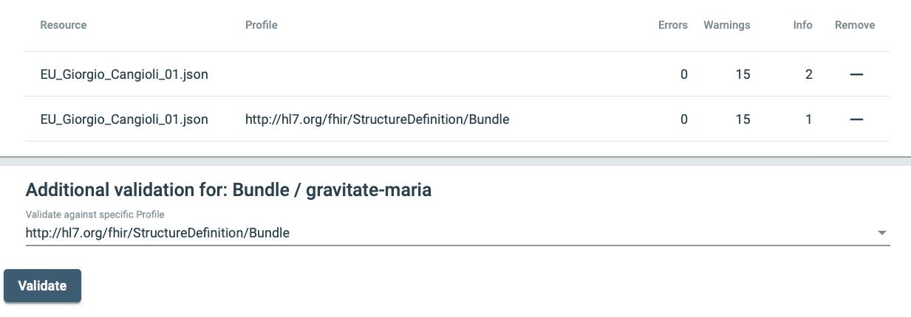

# FHIR Bundle
We are looking at the general structure of a FHIR bundle and the components in a Bundle

1. See http://hl7.org/fhir/bundle.html

2. Review the top level items that are in a FHIR Bundle
  * identifier
  * type
  * timestamp
  * total
  * link
  * entry. This is an array of resources.

3. Open the file [../samples/EU_Giorgio_Cangioli_01.json](../samples/EU_Giorgio_Cangioli_01.json). Note these properties at the top level

|  Element     | Value               |   Notes  |
|--------------|---------------------|----|
| resourceType | Bundle              | Fixed Value |
| id           | gravitate-maria     | Human written, not generated |
| identifier   | maria-ips-1         | Has system and identifier |
| type         | document            | Fixed value |
| timestamp    | 2021-09-03T08:38:00+02:00 | |
| entry        | Array of resources  | Composition, Patient, Practitioner, AllergyIntolerance, Condition (3x), MedicationStatement (3x), Medication (3x) |

* The MedicationStatement resources are referenced by entries in the Composition.
* In turn, the MedicationStatement resources will reference the Medication resources.

4. Compare the property list to the specification at http://hl7.org/fhir/bundle.html
5. Validate this file as a Bundle using an online tool.
  * https://gazelle.ihe.net/matchbox/#/validate
  * Add file: samples/EU_Giorgio_Cangioli_01.json
  * The application recognizes the resource as a Bundle and generates a report
  * Select the profile: http://hl7.org/fhir/StructureDefinition/Bundle and validate again
  * A new report is generated. This report has one fewer info items than the previous report.
  
  * Scroll down through the report. It will provide information with line numbers in the original file.

# FHIR Bundle With Dangling Resource
In this version, we replaced the fullURL of the last Medication resource with a new value (urn:uuid:debc3910-d87c-11ec-9d64-0242ac120002). That means the entry in the section will try to reference a resource that does not exist.

1. Validate this file as a Bundle using the same online tool.
  * https://gazelle.ihe.net/matchbox/#/validate
  * Add file: [../samples/EU_Giorgio_Cangioli_01-a.json](../samples/EU_Giorgio_Cangioli_01-a.json)
  * Make sure you validate as before with the Bundle profile. You get one additional warning:
  : Bundle.entry[9].resource.ofType(MedicationStatement).medication.ofType(Reference):
URN reference is not locally contained within the bundle urn:uuid:9ac3356c-4ea4-4814-84c3-235484f2ef19 
 * That warning matches the change that was made to create samples/EU_Giorgio_Cangioli_01-a.json

## Pages to Read (In Order)
* [FHIR Bundle](01_FHIR_Bundle.md)
* [&rarr; Composition](02_Composition.md)
* [IPS Sections](03_IPS_Sections.md)
* [Header Sections](04_Header_Sections.md)
* [Required Sections](05_Required_Sections.md)
* [Full Resources](06_Full_Resources.md)
* [IPS_Document_Validation/README.md](../IPS_Document_Validation/README.md)
