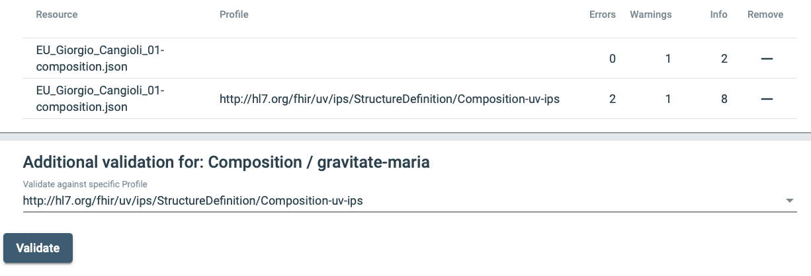

# Composition
1. See http://hl7.org/fhir/composition.html
2. Cherry picked from the introduction; please read the full page
  * ... single logical package that provides a single coherent statement of meaning, establishes its own context and that has clinical attestation with regard to who is making the statement
  * ... a Composition alone does not constitute a document.
  * ... the Composition must be the first entry in a Bundle where Bundle.type=document,
  * and any other resources referenced from Composition must be included as subsequent entries in the Bundle (for example Patient, Practitioner, Encounter, etc.).
3. Review the top level items that are in a FHIR Composition
  * identifier
  * status
  * type
  * category
  * subject
  * encounter
  * date
  * author
  * title
  * Confidentiality
  * attester
  * custodian
  * relatesTo
  * event
  * section
4. Open the file samples/EU_Giorgio_Cangioli_01-composition.json. Note these properties at the top level

| Element         | Value                                         | Comment |
|-----------------|-----------------------------------------------|-------------------|
| resourceType    | Composition                                   | Fixed value   |
| id              | gravitate-maria                               | Hand written identifier |
| status          | final                                         | |
| type            | "code": "60591-5"                             | |
| subject         | urn:uuid:c154158f-6a43-4ab7-8443-e7f4bf915dd5 | Reference |
| date            | 2018-07-10T15:22:00+02:00                     | |
| author          | urn:uuid:1ece89c5-fda3-4db9-ace6-decbe6c603d8 | Reference |
| title           | Patient Summary (Maria Gravitate)             | |
| confidentiality | N                                             | |
| section         |                                               | Array of elements|

5. Compare the property list to the specification at http://hl7.org/fhir/composition.html
6. Validate this file as a Composition using an online tool.
  * https://gazelle.ihe.net/matchbox/#/validate
  * Add file: samples/EU_Giorgio_Cangioli_01-composition.json
  * The application recognizes the resource as a Composition and generates a report
  * Select the profile: http://hl7.org/fhir/StructureDefinition/Composition-uv-ips and validate again.
  * A new report is generated. This report has additional errors and information items not reported when validated against the baseline Composition.
  
  * Scroll down through the report. It will provide information with line numbers in the original file.
  * Note that the extra profile validation discovered two additional errors. The tool developer tells me that is because resources within the Composition were not on the server.

## Pages to Read (In Order)
* [FHIR Bundle](01_FHIR_Bundle.md)
* [Composition](02_Composition.md)
* [&rarr; IPS Sections](03_IPS_Sections.md)
* [Header Sections](04_Header_Sections.md)
* [Required Sections](05_Required_Sections.md)
* [Full Resources](06_Full_Resources.md)
* [IPS_Document_Validation/README.md](../IPS_Document_Validation/README.md)

