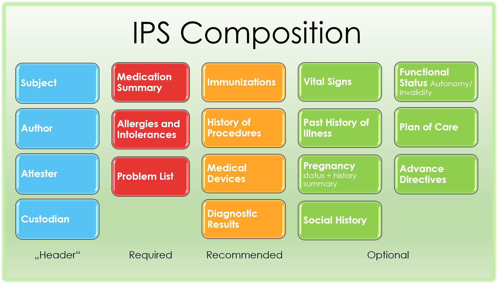

# IPS Sections

1. See: https://build.fhir.org/ig/HL7/fhir-ips/ipsStructure.html
2. List of sections

|  Category    |  Section                     |
|--------------|------------------------------|
| Header       | Subject                      |
| Header       | Author                       |
| Header       | Attester                     |
| Header       | Custodian                    |
| Required     | Medication Summary           |
| Required     | Allergies and Intolerances   |
| Required     | Problem List                 |
| Recommended  | Immunizations                |
| Recommended  | History of Procedures        |
| Recommended  | Medical Devices              |
| Recommended  | Diagnostic Results           |
| Optional     | Vital Signs                  |
| Optional     | Past History of Illness      |
| Optional     | Pregnancy (status + history) |
| Optional     | Social History               |
| Optional     | Functional Status            |
| Optional     | Plan of Care                 |
| Optional     | Advance Directives           |

3. Diagram matching list above

## Pages to Read (In Order)
* [FHIR Bundle](01_FHIR_Bundle.md)
* [Composition](02_Composition.md)
* [IPS Sections](03_IPS_Sections.md)
* [&rarr; Header Sections](04_Header_Sections.md)
* [Required Sections](05_Required_Sections.md)
* [Full Resources](06_Full_Resources.md)
* [IPS_Document_Validation/README.md](../IPS_Document_Validation/README.md)
