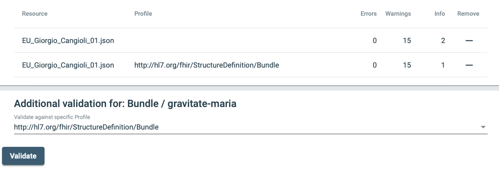

# EU Giorgio Cangioli Exercises

1. Validate this file as a Bundle using an online tool.
  * https://gazelle.ihe.net/matchbox/#/validate
  * Add file: [../samples/EU_Giorgio_Cangioli_01.json](../samples/EU_Giorgio_Cangioli_01.json)
  * The application recognizes the resource as a Bundle and generates a report
  * Select the profile: http://hl7.org/fhir/StructureDefinition/Bundle and validate again
  * A new report is generated. This report has one fewer info items than the previous report.
  
  * Scroll down through the report. It will provide information with line numbers in the original file.
2. Validate this file using the Bundle-uv-ips profile in Matchbox
  * Example IPS missing a required section
  * [../samples-errors/EU_Giorgio_Cangioli_01-b.json](../samples-errors/EU_Giorgio_Cangioli_01-b.json)
  * This document is missing the Allergies and Intolerances section. It is no longer a legal IPS because I removed that data from the Composition.
  * The error message is a bit cryptic. I am in contact with the software owner to improve this.
  
  * See the error for line 1 L1: Bundle)
     * The message says "composition: minimum required = 1, but only found 0". There is a composition, but it is not a legal IPS composition.
     * There is a better message at item 2. below L1. It tells you that the *sectionAllergies* is missing

3. Validate this file in Matchbox
  * Example IPS missing a referenced resource
  * Just validate file. Do not choose the IPS profile.
  * [../samples-errors/EU_Giorgio_Cangioli_01-c.json](../samples-errors/EU_Giorgio_Cangioli_01-c.json)
  * This document is missing the AllergyIntelorance *resource* that is referenced in the Composition.
  * The warning in the screen capture below is displayed because there is a section in the Composition that references urn:uuid:1dff4474-fa08-4f45-8260-dbb23094bf07, but we have removed that resource from the file. 
   

4. Validate that same file using the Bundle-uv-ips profile.
 * This combination generates an error with further informational messages for line 11:
    

