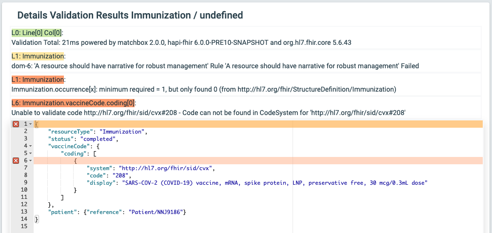
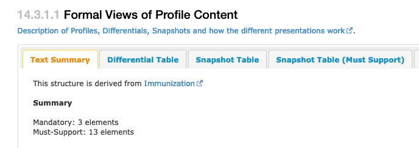
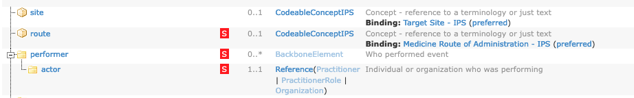

# Immunization Resource
1. See http://hl7.org/fhir/immunization.html
2. Note that most of the elements have a cardinality of 0..1 or 0..*
3. These elements are more restrictive

|  Element      |  Cardinality  |  Type              |
|---------------|---------------|--------------------|
| status        |  1..1         | Code               |
| vaccineCode   |  1..1         | CodeableConcept    |
| patient       |  1..1         | Reference          |
| occurrence[x] |  1..1         | dateTime or string |
4. You can validate a sample immunization that we have provided. You will see an error because the software code not find the specific coded value that was used.
* [../samples/immunization-a.json](../samples/immunization-a.json)
5. Examine / validate this derivative
* [../samples/immunization-b.json]()
* Same as immunization-a.json but have retained only those elements with cardinality of at least 1.
6. The IPS Immunization profile does not show other errors.
7. Examine / validate this derivative
* [../samples-errors/immunization-c.json]()
* Same as immunization-b.json and removed *occurrenceDateTime*
* The validation software reports this defect.

## Resource Profile: Immunization (IPS)
1. See https://build.fhir.org/ig/HL7/fhir-ips/StructureDefinition-Immunization-uv-ips.html
 * In the upper tab: Select *Content*
 * In Section 14.3.1.1, select "Text Summary"

 * There are now 13 *Must-Support* elements
2.  Select the *Differential Table* tab.
 * Note the elements listed as MustSupport. There is a red box with "S" in the center.
 * The screen capture shows several elements in this resource.
     * site remains cardinality 0..1
     * route has cardinality 0..1 but must be supported
     * performer has cardinality 0..* but must be supported

