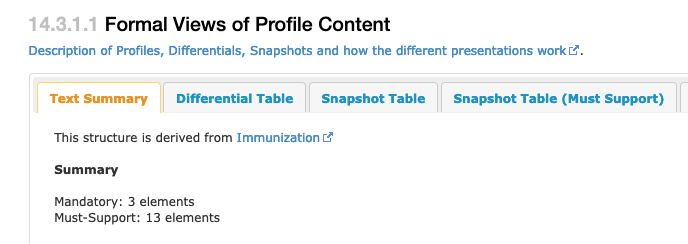

# MustSupport Conformance Rule
1. See https://www.hl7.org/fhir/conformance-rules.html
 * Section 2.1.0.5 MustSupport

2. Annotated copy of text in that section.
 * Labeling an element **MustSupport** means that implementations that produce or consume resources SHALL provide "support" for the element in **some meaningful way**.
     * Meaningful way is not defined by the FHIR base specification.
 * Because the base FHIR specification is intended to be independent of any particular implementation context, **no elements are flagged as mustSupport=true as part of the base specification**.
 * This flag is intended for use in **profiles** that have a defined implementation context.
     ** The International Patient Summary is a profile.
 * For this reason, the specification itself never labels any elements as MustSupport.
 * This is done in StructureDefinitions, where the profile labels an element as mustSupport=true.
 * When a profile does this, it SHALL also make clear exactly what kind of "support" is required, as this could involve expectations around what a system must store, display, allow data capture of, include in decision logic, pass on to other data consumers, etc.

3. Specific guidance for the International Patient Summary is provided here:
 * https://build.fhir.org/ig/HL7/fhir-ips/design.html
 * See Section 3.4

4. Subset of text from Section 3.4
 * Implementers conforming to the IPS Implementation Guide, when creating IPS content
     * SHALL be capable of including mustSupport data elements.
 * Implementers conforming to the IPS Implementation Guide, when receiving IPS content
     * SHALL be capable of processing resource instances containing mustSupport data elements without generating an error or causing the application to fail.
     * SHOULD be capable of displaying mustSupport data elements for human use, or processing (e.g. storing) them for other purposes.
     * SHALL be able to process resource instances containing mustSupport data elements asserting missing information.

5. What does this look like in the Implementaton Guide? We can use Immunization as an example. https://build.fhir.org/ig/HL7/fhir-ips/StructureDefinition-Immunization-uv-ips.html
 * In the upper tab: Select *Content*
 * In Section 14.3.1.1, select "Text Summary"

 * There are now 13 *Must-Support* elements
6.  Select the *Differential Table* tab.
 * Note the red box with "S" inside. This stands for Must Support.
 * The screen capture shows several elements in this resource.
     * site remains cardinality 0..1
     * route has cardinality 0..1 but must be supported
     * performer has cardinality 0..* but must be supported

 * In general, tools do not test for this today.
 * The way to test for this is to provide full clinical samples and ask the operator to import/enter the data and produce the relevant document.
     * Some systems may not have a way to record the data. They are not compliant.
     * In a testing session, I want to see the process used to collect the data to see if it matches a reasonable workflow.